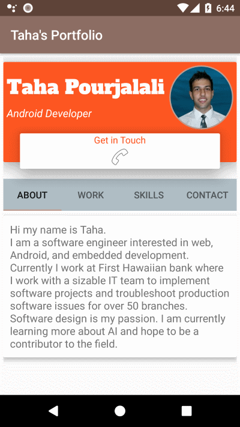
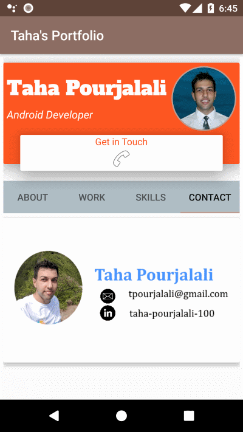

# Android Portfolio App

## Purpose

I wrote this app to practice designing Android layouts using material design components such as CardLayout and Tabs. 

## Preview

## Download 

You can download the apk [here](./readme/app-debug.apk "Download APK") and install it on your phone. Alternatively you may clone the repo and run it on an emulator using AndroidStudio. 